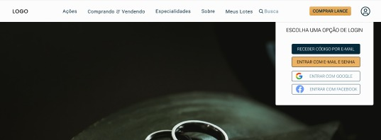

# Leilão 🔨

## Projeto Universitário (UNICID)

(Protótipo Figma)

### 💡 Sobre ;

> O objetivo é criar uma plataforma de leilão que atenda todos os tipos de pessoas, inicialmente será desenvolvido para o nicho de joias, tais como anéis, colares, relógios etc.... Com toda segurança e controle de qualidade possível.

### 📎 Descrição ;

> Nossa plataforma irá contar com diversas categorias de leilões e itens, trazendo tudo isso de forma simples para uma melhor navegação e experiência do usuário. E de forma que atenda o Brasil todo, teremos um sistema de qualidade dos produtos e segurança tanto dos dados quanto dos produtos, afim de evitar golpes e qualquer outro tipo de problema que possa prejudicar o usuário.
